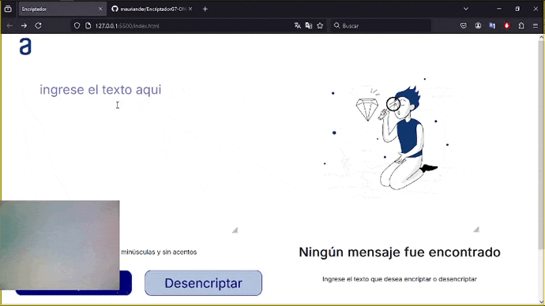

# EncriptadorG7-ONE

_Este es un proyecto de aplicación web que permite a los usuarios encriptar y desencriptar texto utilizando reglas de sustitución específicas. Para este desafío, aplicamos conocimientos de lógica de programación en un contexto práctico._
* [DEPLOY](https://mauriander.github.io/EncriptadorG7-ONE/)



## Funcionalidades
El encriptador de texto sustituye ciertas letras del alfabeto por palabras específicas, lo que permite transformar y proteger el contenido de tus mensajes. Además, la aplicación incluye una funcionalidad para volver a convertir el texto encriptado a su forma original.
Funcionalidades

    ## Encriptador de Texto:
        Convierte letras minúsculas en palabras específicas:
            e → enter
            i → imes
            a → ai
            o → ober
            u → ufat

    ## Desencriptador de Texto:
        Convierte las palabras encriptadas de vuelta a sus letras originales:
            enter → e
            imes → i
            ai → a
            ober → o
            ufat → u

    ## Validación de Entrada:
        Verifica que el texto contenga únicamente letras minúsculas sin acentos o caracteres especiales.
        Muestra un mensaje de error si se encuentran letras mayúsculas, acentos o números o caracteres especiales.

## Interfaz de usuario
        Campo de entrada para el texto.
        Botones para encriptar y desencriptar.
        Área para mostrar el texto encriptado o desencriptado.
        Botón para copiar el texto al portapapeles.


## Comenzando 🚀

### Pre-requisitos 📋
```
- Conexión a internet
- Navegador web compatible (Chrome, Firefox, etc.)
- Editor de código como VSCode.
```

### Instalación 🔧

```
1. Clona el repositorio: `git clone https://github.com/tu_usuario/EncriptadorG7-ONE.git`
2. Abre el proyecto en tu editor de código.
3. Abre el archivo `index.html` en tu navegador para ver la aplicación en funcionamiento.
```
```
Prueba la encriptación y desencriptación ingresando texto en el campo de entrada y utilizando los botones correspondientes.
```


## Intrucciones de Uso

    Digite el texto: Ingresa el texto que deseas encriptar o desencriptar en el campo de entrada.
    Encriptar: Haz clic en el botón "Encriptar" para convertir el texto según las reglas .
    Desencriptar: Haz clic en el botón "Descencriptar" para devolver el texto encriptado a su forma original.
    Copiar: Usa el botón de copiar para guardar el texto en el portapapeles.

## Despliegue 📦

```
* [CHALLENGE](https://mauriander.github.io/EncriptadorG7-ONE/)
```

## Construido con 🛠️

_Menciona las herramientas que utilizaste para crear tu proyecto_

* [HTML](https://developer.mozilla.org/es/docs/Web/HTML) - Estructura de la aplicación
* [CSS](https://developer.mozilla.org/es/docs/Web/CSS) - Diseño visual
* [JavaScript](https://developer.mozilla.org/es/docs/Web/JavaScript) - Lógica de encriptación y desencriptación


## Autores ✒️

* **Mauricio Andermatten** - *Challenge G7-ONE* - [mauriander](https://github.com/mauriander)

